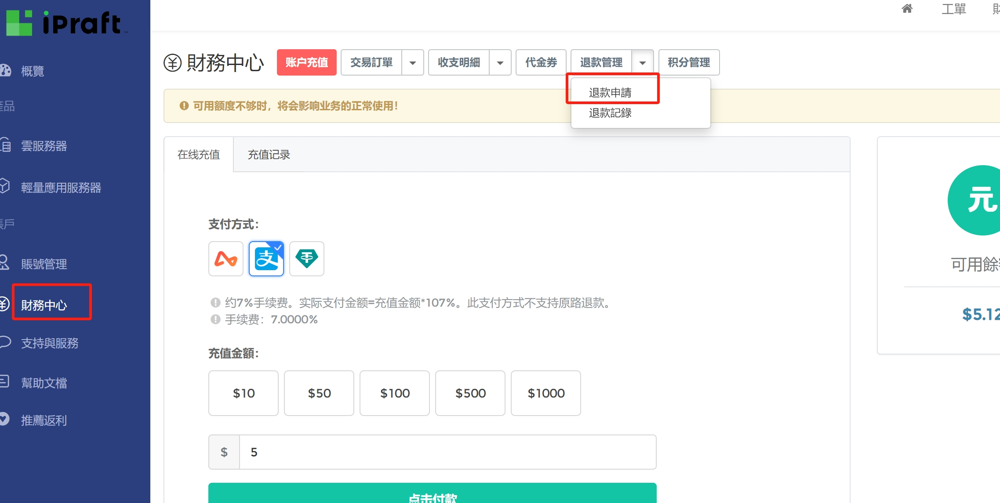

## 购买服务器图片演示

1、选择服务器
我选择的服务器：https://ipraft.com/?i71b7cf

  

  

  

然后下载FinalShell连接你的虚拟器

下载地址（windows版本）是：http://www.hostbuf.com/downloads/finalshell_windows_x64.exe

其他版本下载地址是：FinalShell SSH工具,服务器管理,远程桌面加速软件,支持Windows,macOS,Linux,版本4.3.10,更新日期2023.12.31 - FinalShell官网

  

安装X-UI面板命令
bash <(curl -Ls https://raw.githubusercontent.com/vaxilu/x-ui/master/install.sh)
要关闭防火墙，或者开通端口才能访问地址
对于使用firewalld的CentOS 8及以上版本：
停止防火墙服务:

sudo systemctl stop firewalld

禁用防火墙服务的自启动:

sudo systemctl disable firewalld

确认防火墙已关闭:

sudo systemctl status firewalld

安装完之后输入Y，账号，密码，端口，然后x-ui start （要关闭防火墙，或者开通端口才能访问地址）然后你的服务器ip加你的端口号，我的是7004

  

  

  

注意重要内容
三、手机端配置：最好是ios系统，基本思路就是把手机重置了把能共享、定位的功能都关了，再把手机的语言和时区设置成你想运营的那个地方的一致就行了。（手机端环境一定要配置好，环境不吻合视频容易限流或封号）尽量一个tk号一固定ip不要到处飘！ios手机不能插手机卡！

然后去地址测一下你的IP是否正常,输入你购买的服务器IP，如果显示ip不行可以退款，1天内可以退款，然后重新买，地址是：http://www.ipjiance.com

  

  

